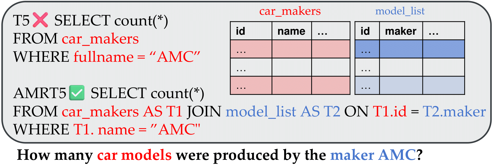
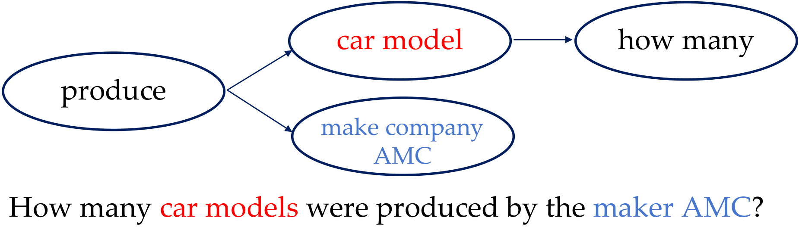

# TAMR

This repository contains the official implementation of experiments conducted in
- TAMR - A Lightweight AMR Toolkit For Enhancing NL2SQL Solutions (ICDE 2025 Submission)



### Repo structure:
- `configs`: Json files for various running configurtions
- `seq2seq`: Codebase for **NL2SQL** experiments, which is adapted from [Picard](https://github.com/ServiceNow/picard) for the file structure.
  - `datasets`: Dataset related python files
  - `metrics`: Metrics related python files
  - `utils`: Folder with python utility files
- `T5`: A modified T5 architecture with AMR augmented, which is derived from [Huggingface Transformers](https://github.com/huggingface/transformers).
- `run_seq2seq_internal.py`: A python file for training main experiments.

For GPT4-based, please refer to [https://github.com/causalNLP/amr_llm](https://github.com/causalNLP/amr_llm?tab=readme-ov-file#task-1-get-llms-inference-performance). We modified the prompt as indicated in Table III to V.

### Dependencies
 - python3.7 or above
   
Install python packages

```bash
pip install -r requirements.txt
```

### Basic Usage

Train AMRT5-large (LN) model
```bash
python run_seq2seq_internal.py --config_files=configs/train_amr.json
```

Train AMRT5-large (SC) model
```bash
python run_seq2seq_internal.py --config_files=configs/train_amr_sc.json
```

Train AMRT5-3B (SC) model
```bash
python run_seq2seq_internal.py --config_files=configs/train_amr_3B.json
```

Eval the model A 
```bash
python run_seq2seq_internal_eval.py --model_path=path/to/ckpt_A
```

### NL2SQL datasets

| Dataset        |Link|
|------------------|-----------------|
| Spider        |  https://drive.usercontent.google.com/download?id=1iRDVHLr4mX2wQKSgA9J8Pire73Jahh0m&export=download&authuser=0           | 
| SYN | https://github.com/ygan/Spider-Syn            |
| DK        | https://github.com/ygan/Spider-DK            |
| REALISTIC |https://zenodo.org/records/5205322            |

We also provide preprocessed datasets in the folder `data`.

## AMR

 

AMR is a comprehensive semantic graph representation of a sentence. It utilizes a directed acyclic graph structure with a root node and represents important concepts as nodes and semantic relationships as edges.

AMR can help PLM to augment their semantics to strive a better trade off between efficiency and effectiveness.

### AMR parser

The parser we choose is orginal from [here](https://github.com/goodbai-nlp/AMRBART). We modified this to be suitable for Natural Language Questions (NLQs) by retraining it using [a corpus of NLQ-AMR pairs](https://github.com/IBM/AMR-annotations).


## Datasets Citations

```
@inproceedings{Yu&al.18c,
  title     = {Spider: A Large-Scale Human-Labeled Dataset for Complex and Cross-Domain Semantic Parsing and Text-to-SQL Task},
  author    = {Tao Yu and Rui Zhang and Kai Yang and Michihiro Yasunaga and Dongxu Wang and Zifan Li and James Ma and Irene Li and Qingning Yao and Shanelle Roman and Zilin Zhang and Dragomir Radev}
  booktitle = "Proceedings of the 2018 Conference on Empirical Methods in Natural Language Processing",
  address   = "Brussels, Belgium",
  publisher = "Association for Computational Linguistics",
  year      = 2018
}

@inproceedings{gan-etal-2021-towards,
    title = "Towards Robustness of Text-to-{SQL} Models against Synonym Substitution",
    author = "Gan, Yujian  and
      Chen, Xinyun  and
      Huang, Qiuping  and
      Purver, Matthew  and
      Woodward, John R.  and
      Xie, Jinxia  and
      Huang, Pengsheng",
    month = aug,
    year = "2021",
    address = "Online",
    publisher = "Association for Computational Linguistics",
    url = "https://aclanthology.org/2021.acl-long.195",
    doi = "10.18653/v1/2021.acl-long.195",
    pages = "2505--2515",
}

@misc{gan2021exploring,
      title={Exploring Underexplored Limitations of Cross-Domain Text-to-SQL Generalization}, 
      author={Yujian Gan and Xinyun Chen and Matthew Purver},
      year={2021},
      eprint={2109.05157},
      archivePrefix={arXiv},
      primaryClass={cs.CL}
}

@article{deng2020structure,
  title={Structure-Grounded Pretraining for Text-to-SQL},
  author={Deng, Xiang and Awadallah, Ahmed Hassan and Meek, Christopher and Polozov, Oleksandr and Sun, Huan and Richardson, Matthew},
  journal={arXiv preprint arXiv:2010.12773},
  year={2020}
}
```


## License

MIT
